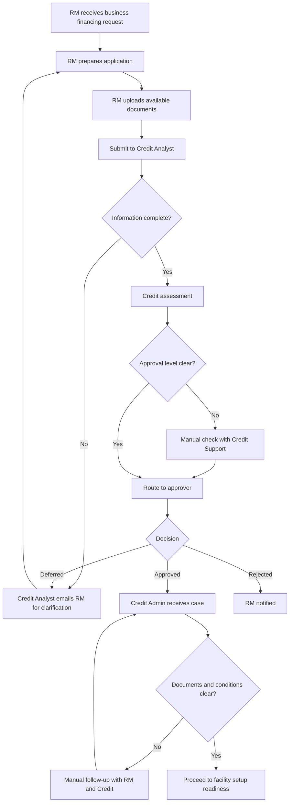
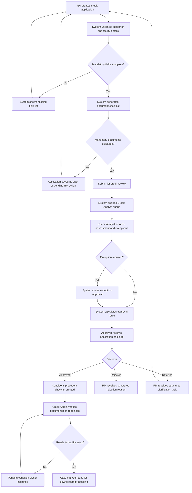

# As-Is and To-Be Process

## As-Is Process

## As-Is Pain Points

| Area | Observation | Why It Matters |
| --- | --- | --- |
| Application intake | Mandatory fields can be bypassed or completed inconsistently. | Incomplete cases create avoidable rework. |
| Document checklist | Checklist is not always generated by product, customer type, and collateral type. | RM and Credit Admin may disagree on what is required. |
| Approval routing | Some routing decisions depend on manual interpretation. | Routing errors delay approval and weaken auditability. |
| Exception handling | Policy exceptions may be described in free text. | Exceptions are harder to categorize, approve, and report. |
| Case visibility | Users rely on messages or trackers for status updates. | Management cannot easily identify bottlenecks. |

## To-Be Process

## Main Process Changes

| Change | Rationale |
| --- | --- |
| Add pre-submission validation | Prevent known incomplete cases from entering the Credit Analyst queue. |
| Generate dynamic document checklist | Reduce manual checklist interpretation and improve consistency. |
| Introduce structured exception capture | Support proper review, approval, and exception reporting. |
| Automate approval route recommendation | Reduce routing errors while keeping final approval ownership with authorized users. |
| Create condition precedent tracking | Make post-approval readiness visible before downstream processing. |
| Add status and ownership dashboard | Reduce manual status chasing and improve management oversight. |

## To-Be Status Model

| Status | Owner | Exit Condition |
| --- | --- | --- |
| Draft | RM | Required application fields completed. |
| Pending RM Action | RM | Missing information, documents, or clarification resolved. |
| Pending Credit Review | Credit Analyst | Assessment completed and recommendation submitted. |
| Pending Exception Approval | Exception Approver | Exception approved or rejected. |
| Pending Credit Approval | Credit Approver | Credit decision recorded. |
| Pending Conditions | RM / Credit Admin | Conditions precedent completed or waived. |
| Ready for Facility Setup | Credit Admin | Documentation readiness confirmed. |
| Rejected | RM | Customer notified and case closed. |
| Withdrawn | RM | Customer request or business decision recorded. |

