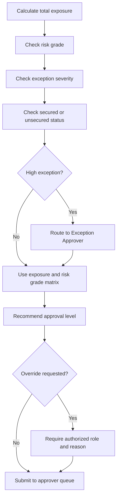

# Business Rules and Approval Matrix

This page contains synthetic rules for portfolio demonstration. They are not copied from any bank's internal policy.

## Rule Design Principles

- Rules should prevent known operational errors before submission.
- Rules should guide users without removing human credit judgment.
- Approval routing should be explainable and auditable.
- Exceptions should be visible, categorized, and approved by the right authority.
- Waivers and overrides should require maker-checker control.

## Core Business Rules

| Rule ID | Rule | Trigger | System Action | Rationale |
| --- | --- | --- | --- | --- |
| BR001 | New application onboarding | Application type = New. | Generate full customer onboarding, declaration, profile, and screening evidence. | New borrowers require complete identity and authority evidence. |
| BR002 | Renewal financial refresh | Application type = Renewal or financial evidence is assessed. | Require refreshed financial and conduct evidence. | Reused profile data does not replace current repayment assessment. |
| BR003 | Enhancement approval package | Application type = Enhancement or facility terms change. | Generate revised approval memo and updated facility documents. | Changed exposure and terms require a versioned approval package. |
| BR004 | Property collateral evidence | Collateral type = Property. | Require title, valuation, insurance, and charge documents; proposed v2.3 adds land search and valuation recency. | Security ownership, value, protection, and perfection must be evidenced. |
| BR005 | Financial statement waiver | Latest financial statement = Not Available or Waiver Requested. | Require waiver, exception memo, alternative evidence, maker-checker, and escalation. | Missing financial evidence must use a controlled exception path. |
| BR006 | High-risk enhanced due diligence | Risk level = High. | Require EDD checklist and high-risk approval note; block incomplete submission. | Higher-risk customers require additional compliance evidence. |
| BR007 | Unsecured credit justification | Collateral type = Unsecured or repayment relies on cash flow. | Require additional credit justification and repayment capacity analysis. | Unsecured exposure requires stronger repayment evidence. |
| BR008 | Trade facility documents | Facility type = Trade Line. | Require trade agreement, supporting trade documents, and counterparty information. | Product-specific evidence supports trade purpose and settlement risk review. |
| BR009 | Bank guarantee documents | Facility type = Bank Guarantee. | Require BG application, counter indemnity, and beneficiary details. | Guarantee obligations require product-specific enforceability evidence. |
| BR010 | Company authorization | Customer type = SME Company, Corporate, or Partnership. | Require board resolution and authorized signatory verification. | Borrowing and document execution authority must be validated. |
| BR011 | Cash or fixed-deposit security | Collateral type = Cash Deposit or Fixed Deposit. | Require deposit receipt and set-off letter. | Deposit evidence and set-off rights support enforceability. |
| BR012 | Guarantee enforceability | Collateral type = Corporate Guarantee or Personal Guarantee. | Require guarantee agreement, authority, and identity verification. | Guarantee security is only useful when execution is enforceable. |
| BR013 | Risk-based approval authority | Exposure, risk, collateral, segment, application, facility, or exception changes. | Recalculate approval tier, rationale, SLA, controls, and escalation triggers. | Delegated authority must reflect the complete risk context. |
| BR014 | Controlled route override | Authorized user changes recommended route. | Require reason, authority, maker-checker, and audit event. | Prevents undocumented approval authority changes. |
| BR015 | Exception and pipeline visibility | Exception, route, owner, UAT, or readiness state changes. | Refresh dashboards and traceability references. | Governance review needs a current risk and bottleneck position. |
| BR016 | Evidence-grounded document generation | Credit memo draft is generated, reviewed, or approved. | Link every section to source fields, rules, confidence, missing evidence, version, and human approval. | Generated narrative must remain explainable and accountable. |
| BR017 | Controlled rule lifecycle | A high-impact business rule is proposed or changed. | Require owner, checker, version, effective date, impact analysis, regression evidence, and activation decision. | Rule changes can alter credit decisions and control outcomes. |
| BR018 | Critical data lineage and quality | A critical input feeds a credit rule, document, or report. | Record definition, source, transformation, owner, checks, quality, lineage, and issue impact. | Downstream decisions are only reliable when material data is controlled. |
| BR019 | Benefits realization ownership | A product outcome or investment assumption is defined or updated. | Maintain baseline, target, current result, owner, evidence source, and financial viability. | Product success must be measured after delivery. |
| BR020 | Evidence-led release decision | A release gate, cutover step, or hypercare threshold changes. | Derive Go / No-Go posture and preserve evidence, sign-off, validation, and rollback criteria. | Production readiness must be based on accountable evidence. |

## Facility Types

| Facility Type | Example Purpose | Key Data Required |
| --- | --- | --- |
| Term Loan | Machinery purchase, renovation, business expansion | Amount, tenor, repayment source, collateral, purpose. |
| Overdraft | Working capital | Limit amount, expiry date, account conduct, renewal indicator. |
| Trade Line | Import/export trade financing | Trade product type, limit, tenor, transaction purpose. |
| Bank Guarantee | Contract performance, tender support | Guarantee amount, beneficiary, expiry, claim risk notes. |

## Approval Matrix

The approval matrix below is simplified for portfolio use.

| Total Exposure | Low Risk / Fully Secured | Medium Risk or Partial Security | High Risk, Unsecured, or Major Exception |
| ---: | --- | --- | --- |
| Up to USD 250,000 | Credit Analyst Review | Regional Credit Manager | Country Credit Committee |
| USD 250,001 to USD 1,000,000 | Regional Credit Manager | Regional Credit Manager | Country Credit Committee |
| USD 1,000,001 to USD 5,000,000 | Regional Credit Manager | Country Credit Committee | Group Credit Committee |
| Above USD 5,000,000 | Country Credit Committee | Group Credit Committee | Group Credit Committee plus exception approval |

## Approval Routing Logic

## Approval Routing Score Factors

| Factor | Example Impact |
| --- | --- |
| Total exposure | Higher exposure increases approval authority. |
| Risk level | High risk increases routing score and control review. |
| Collateral coverage | Unsecured exposure requires stronger rationale and maker-checker control. |
| Exception severity | Major or critical exceptions trigger escalation and approval evidence. |
| Customer segment | Large corporate cases may require higher governance visibility. |
| Application type | New and enhancement cases require additional package review. |

## Exception Categories

| Exception Type | Severity Guide | Example |
| --- | --- | --- |
| Financial Ratio | Medium to High | Debt service ratio outside preferred threshold. |
| Documentation | Low to Medium | Latest financial statement pending but interim accounts provided. |
| Collateral | Medium to High | Collateral shortfall or valuation pending. |
| Conduct | Medium to High | Irregular account conduct or repayment behavior. |
| Policy Eligibility | High | Customer falls outside normal product eligibility. |
| Pricing | Low to Medium | Special pricing requested below standard margin. |

## Document Checklist Logic

| Condition | Mandatory Checklist Items |
| --- | --- |
| New business borrower | Business registration, company profile, latest financial statements, bank statements, ownership details. |
| Renewal case | Updated financial statements, conduct review, existing facility review, updated security status. |
| Property collateral | Valuation report, title details, insurance requirement, security perfection status. |
| Corporate guarantor | Guarantor profile, authorization document, financial summary where applicable. |
| Trade facility | Trade transaction profile, buyer/supplier information, facility purpose notes. |
