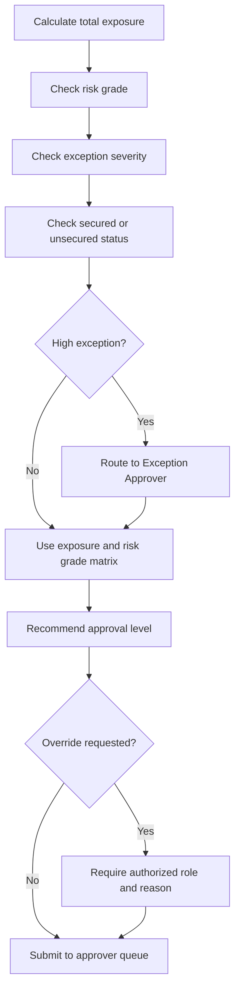

# Business Rules and Approval Matrix

This page contains synthetic rules for portfolio demonstration. They are not copied from any bank's internal policy.

## Rule Design Principles

- Rules should prevent known operational errors before submission.
- Rules should guide users without removing human credit judgment.
- Approval routing should be explainable and auditable.
- Exceptions should be visible, categorized, and approved by the right authority.
- Waivers and overrides should require maker-checker control.

## Core Business Rules

| Rule ID | Rule | Trigger | System Action | Rationale |
| --- | --- | --- | --- | --- |
| BR-001 | Business registration number is mandatory for non-individual borrowers. | Customer type = Company, Partnership, or Sole Proprietor. | Block submission if missing. | Needed to identify borrower entity. |
| BR-002 | At least one facility must be added before submission. | RM clicks Submit. | Block submission if no facility exists. | Credit application without facility request cannot be assessed. |
| BR-003 | Total exposure is calculated as existing exposure plus proposed exposure. | Facility amount is added or amended. | Recalculate approval route. | Approval authority should consider total exposure. |
| BR-004 | Secured facilities require collateral details before submission. | Facility secured flag = Yes. | Block submission if collateral type and value are missing. | Collateral supports credit assessment and documentation. |
| BR-005 | Mandatory document checklist is generated by facility, borrower, and collateral type. | RM saves facility or collateral details. | Add required checklist items. | Reduces manual checklist interpretation. |
| BR-006 | High-severity exception requires exception approval before final credit approval. | Exception severity = High. | Route to Exception Approver. | Ensures exceptions are explicitly approved. |
| BR-007 | Deferred decision must include clarification item and owner. | Approver selects Deferred. | Block decision if clarification is empty. | Prevents vague deferral notes. |
| BR-008 | Waiver reason is mandatory for waived documents or conditions. | User selects Waived. | Require reason and approver. | Supports auditability. |
| BR-009 | Maker cannot approve own waiver or route override. | Waiver or override submitted. | Hide or block approval action for maker. | Maintains segregation of duties. |
| BR-010 | Case cannot be marked Ready for Facility Setup with open mandatory conditions. | Credit Admin clicks Ready. | Block action and show open condition list. | Prevents premature downstream processing. |
| BR-013 | Approval authority is recommended from exposure, risk level, collateral coverage, segment, application type, and exception severity. | Credit case inputs are saved or changed. | Generate recommended approval tier with rationale. | Reduces manual routing error and supports delegated authority control. |
| BR-014 | Approval route override must be controlled. | Authorized user changes recommended route. | Require reason, authorized role, maker-checker check, and audit event. | Prevents undocumented approval authority changes. |
| BR-015 | Policy exceptions and owner changes must refresh management visibility. | Exception status, route, or owner changes. | Update dashboard indicators and traceability references. | Ensures governance review sees current risk and bottleneck position. |
| BR-016 | Case release posture is derived from readiness gates. | Case 360 view is opened or gate status changes. | Display Not Ready if any gate is Block, Controlled Watch if any gate is Watch, and Ready only when all gates Pass. | Prevents a case from appearing ready when control evidence is incomplete. |

## Facility Types

| Facility Type | Example Purpose | Key Data Required |
| --- | --- | --- |
| Term Loan | Machinery purchase, renovation, business expansion | Amount, tenor, repayment source, collateral, purpose. |
| Overdraft | Working capital | Limit amount, expiry date, account conduct, renewal indicator. |
| Trade Line | Import/export trade financing | Trade product type, limit, tenor, transaction purpose. |
| Bank Guarantee | Contract performance, tender support | Guarantee amount, beneficiary, expiry, claim risk notes. |

## Approval Matrix

The approval matrix below is simplified for portfolio use.

| Total Exposure | Low Risk / Fully Secured | Medium Risk or Partial Security | High Risk, Unsecured, or Major Exception |
| ---: | --- | --- | --- |
| Up to USD 250,000 | Credit Analyst Review | Regional Credit Manager | Country Credit Committee |
| USD 250,001 to USD 1,000,000 | Regional Credit Manager | Regional Credit Manager | Country Credit Committee |
| USD 1,000,001 to USD 5,000,000 | Regional Credit Manager | Country Credit Committee | Group Credit Committee |
| Above USD 5,000,000 | Country Credit Committee | Group Credit Committee | Group Credit Committee plus exception approval |

## Approval Routing Logic

## Approval Routing Score Factors

| Factor | Example Impact |
| --- | --- |
| Total exposure | Higher exposure increases approval authority. |
| Risk level | High risk increases routing score and control review. |
| Collateral coverage | Unsecured exposure requires stronger rationale and maker-checker control. |
| Exception severity | Major or critical exceptions trigger escalation and approval evidence. |
| Customer segment | Large corporate cases may require higher governance visibility. |
| Application type | New and enhancement cases require additional package review. |

## Exception Categories

| Exception Type | Severity Guide | Example |
| --- | --- | --- |
| Financial Ratio | Medium to High | Debt service ratio outside preferred threshold. |
| Documentation | Low to Medium | Latest financial statement pending but interim accounts provided. |
| Collateral | Medium to High | Collateral shortfall or valuation pending. |
| Conduct | Medium to High | Irregular account conduct or repayment behavior. |
| Policy Eligibility | High | Customer falls outside normal product eligibility. |
| Pricing | Low to Medium | Special pricing requested below standard margin. |

## Document Checklist Logic

| Condition | Mandatory Checklist Items |
| --- | --- |
| New business borrower | Business registration, company profile, latest financial statements, bank statements, ownership details. |
| Renewal case | Updated financial statements, conduct review, existing facility review, updated security status. |
| Property collateral | Valuation report, title details, insurance requirement, security perfection status. |
| Corporate guarantor | Guarantor profile, authorization document, financial summary where applicable. |
| Trade facility | Trade transaction profile, buyer/supplier information, facility purpose notes. |
