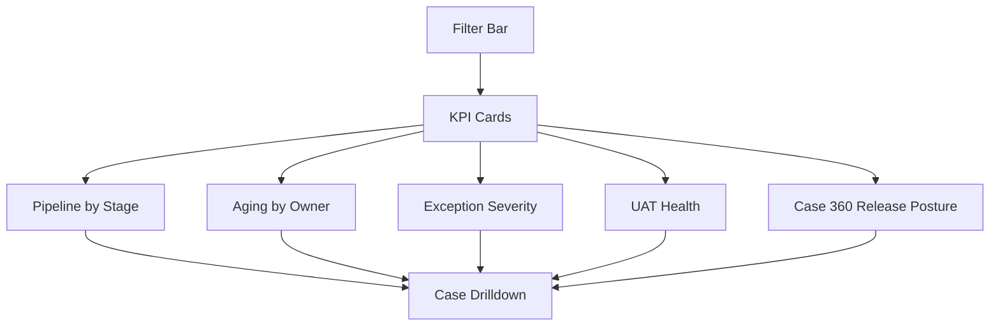

# Dashboard Mockup

This dashboard is intended for business monitoring, not financial reporting. It helps Product Owners, Credit Operations, and team leads identify bottlenecks in the credit pipeline.

## Dashboard Filters

| Filter | Example Values |
| --- | --- |
| Date range | Current month, previous month, custom range |
| Segment | SME, Commercial, Corporate |
| Facility type | Term Loan, Overdraft, Trade Line, Bank Guarantee |
| RM team | Region A, Region B, Region C, Region D |
| Analyst queue | SME Credit, Commercial Credit, Trade Credit |
| Application type | New, Renewal, Enhancement, Restructure |

## KPI Cards

| KPI | Definition | Sample Value |
| --- | --- | ---: |
| Applications submitted | Count of cases submitted during selected period. | 148 |
| Total requested exposure | Sum of proposed facility amount. | USD 86.4m |
| Average submission-to-decision TAT | Average working days from submitted date to decision date. | 6.2 days |
| Cases pending RM action | Open cases waiting for RM clarification or document upload. | 23 |
| Cases beyond SLA | Cases pending beyond configured status-level threshold. | 17 |
| Exception approval rate | Approved exceptions divided by total exception requests. | 74% |
| Document readiness | Completed or waived mandatory documents divided by expected mandatory documents. | 84% |
| Open high priority UAT | High-priority test cases not yet passed. | 6 |
| Case release posture | Count of selected cases marked Ready, Controlled Watch, or Not Ready based on readiness gates. | 3 cases |

## Pipeline by Status

| Status | Case Count | Requested Exposure USD | Aging Concern |
| --- | ---: | ---: | --- |
| Draft | 31 | 12,800,000 | Low |
| Pending RM Action | 23 | 9,600,000 | Medium |
| Pending Credit Review | 38 | 21,400,000 | Medium |
| Pending Exception Approval | 9 | 7,200,000 | High |
| Pending Credit Approval | 19 | 18,900,000 | Medium |
| Pending Conditions | 16 | 11,500,000 | Medium |
| Ready for Facility Setup | 12 | 5,000,000 | Low |

## Aging View

| Owner Group | 0-2 Days | 3-5 Days | 6-10 Days | Above 10 Days |
| --- | ---: | ---: | ---: | ---: |
| RM | 8 | 7 | 5 | 3 |
| Credit Analyst | 14 | 12 | 8 | 4 |
| Exception Approver | 2 | 3 | 2 | 2 |
| Credit Approver | 7 | 6 | 4 | 2 |
| Credit Admin | 5 | 6 | 3 | 2 |

## Exception Register Summary

| Exception Type | Open | Approved | Rejected | Avg Aging Days |
| --- | ---: | ---: | ---: | ---: |
| Documentation | 11 | 24 | 3 | 4.1 |
| Financial Ratio | 5 | 12 | 4 | 5.6 |
| Collateral | 4 | 8 | 2 | 6.3 |
| Conduct | 3 | 7 | 5 | 7.0 |
| Pricing | 2 | 9 | 1 | 3.2 |

## Dashboard Layout

## Drilldown Columns

| Column | Purpose |
| --- | --- |
| Application ID | Case reference for follow-up. |
| Customer Name | Business customer display name. |
| RM Owner | Front-line owner. |
| Current Status | Process stage. |
| Current Owner | User or queue responsible for next action. |
| Days in Status | Aging measure. |
| Requested Exposure | Proposed amount. |
| Exception Flag | Indicates whether exception exists. |
| Next Due Date | Due date for current open action. |

## Dashboard Controls

| Control | Reason |
| --- | --- |
| Role-based access | Users should see only authorized portfolio or management-level data. |
| Export control | Case-level export should be limited to authorized roles. |
| Daily refresh | Operational dashboard does not require real-time refresh for the portfolio simulation. |
| Data reconciliation | Dashboard totals should reconcile to case records for selected date range. |
