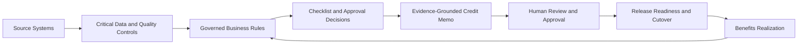

# Information Architecture

## Navigation

| Page | Purpose |
| --- | --- |
| Home | Portfolio introduction, quick stats, module entry points. |
| Dashboard | Credit operations control room for pipeline aging, owner bottlenecks, exceptions, UAT, CR, and traceability metrics. |
| Case 360 | End-to-end case lifecycle evidence across case profile, documents, analysis, approval route, exceptions, UAT, audit, readiness gates, BA recommendation, and next actions. |
| Credit Memo Studio | Evidence-grounded document generation with section-level source lineage, rule mapping, confidence, missing-evidence blockers, human review, version comparison, approval, and export. |
| Rule Governance | Controlled rule registry, current-to-proposed comparison, maker-checker lifecycle, impact analysis, regression Test Lab, and activation gate. |
| Data Governance | Critical data definitions, system-of-record lineage, transformation, rules, decision outputs, owners, quality controls, and issue impact. |
| Value Realization | Adjustable financial case, benefits scorecard, metric ownership, realization progress, and outcome-led product roadmap. |
| Release Readiness | Evidence-led Go / No-Go gates, cutover sequence, rollback triggers, decision pack, and hypercare thresholds. |
| Approval Routing | Risk-based delegated authority simulation for exposure, risk, collateral, segment, and exception severity. |
| Exception Register | Policy exception governance with severity, owner, mitigation, aging, approval tier, and evidence. |
| Checklist Generator | Rule-driven document requirement generation, document status review, waiver approval workflow, SLA aging, package summary, and submission readiness gate. |
| UAT Tracker | UAT test case management and delivery monitoring. |
| CR Impact | Change request impact analysis and BA recommendation. |
| Role View | Stakeholder responsibilities, control focus, role UAT queue, and CR exposure. |
| Traceability | Requirement-to-rule-to-test-to-CR mapping. |
| Audit Trail | Local activity log for key BA workflow actions. |
| About Project | Case study explaining BA thinking and portfolio positioning. |

## Data Model

| Model | Description |
| --- | --- |
| ChecklistInput | User-selected application, facility, collateral, customer, risk, and financial statement values. |
| ApprovalRoutingInput | Application, facility, segment, exposure, risk, collateral coverage, and exception severity. |
| ApprovalRouteResult | Recommended approval tier, routing score, SLA, maker-checker requirement, rationale, controls, and escalation triggers. |
| ChecklistDocument | Generated document with category, requirement level, reason, business rule, review status, SLA status, waiver reason, and waiver approval state where applicable. |
| BusinessRule | Rule ID, description, and control point. |
| PolicyException | Exception ID, type, severity, status, owner, mitigation, approval tier, linked requirement, linked UAT case, and evidence. |
| CreditPipelineCase | Case ID, segment, facility, exposure, risk, stage, owner role, aging, exception count, and document readiness. |
| CreditCase360 | Case-level lifecycle record with profile, current stage, owner, approval tier, linked exception IDs, linked UAT IDs, readiness gates, BA recommendation, and next best actions. |
| CaseLifecycleStep | Workflow step status, owner, aging, control objective, evidence, and risk signal. |
| CaseReadinessGate | Gate status, owner, evidence, linked requirement, and linked UAT case. |
| UatTestCase | Test case ID, requirement, scenario, steps, expected result, priority, status, role, tester, defect, retest status, root cause, and remarks. |
| ChangeRequest | CR impact across requirements, UAT, roles, rules, risks, recommendation, and test scope. |
| TraceabilityItem | Requirement mapping to business rule, UAT case, CR, and status. |
| AuditEvent | Local event record showing workflow action, actor, module, and timestamp. |
| CreditMemoProfile | Borrower, facility purpose, financial indicators, repayment source, risks, mitigants, conditions, source records, and missing evidence. |
| CreditMemoSection | Generated narrative, source fields, business rules, confidence, missing evidence, and review/approval status. |
| GovernedRule | Rule versions, lifecycle, owner, checker, effective date, risk, logic comparison, rationale, and downstream impact. |
| RuleTestScenario | Controlled checklist input, expected documents, expected rules, linked rule, and expected outcome. |
| CriticalDataElement | Business definition, source system and field, transformation, linked rule, output use, owner, quality score, lineage coverage, and checks. |
| DataQualityIssue | Severity, root cause, downstream decision impact, owner, status, and remediation date. |
| BenefitMetric | Baseline, target, current result, direction, unit, owner, measurement definition, and evidence source. |
| ProductRoadmapItem | Outcome, horizon, value, risk reduction, effort, priority score, and delivery status. |
| ReleaseGate | Domain, status, owner, exit criteria, evidence, linked items, and sign-off. |
| CutoverStep | Sequence, window, owner, status, validation, and rollback trigger. |
| HypercareMetric | Early-life target, current result, status, and accountable owner. |

## Business Rule Design

The checklist module uses a rule engine in `lib/checklist-rules.ts`. UI selections are passed into `generateChecklist`, which returns:

- generated documents
- triggered business rules
- risk warnings
- document status and submission readiness signals
- waiver approval state
- SLA watch and breach indicators
- package summary posture and BA recommendation

The UI does not hardcode final checklist output. It renders the rule engine result and layers review status, waiver workflow, SLA indicators, and package posture on top for submission readiness control.

## Decision and Evidence Flow

The same mock case evidence is reused across modules so a reviewer can follow a source field or control issue into rule impact, document output, UAT coverage, release posture, and value measurement.

## Page Design

The interface is designed like an enterprise internal dashboard:

- grouped desktop navigation and mobile menu
- summary cards
- filter panels
- data tables
- charts
- badges
- risk panels
- export actions
- local activity log
- dark mode support
