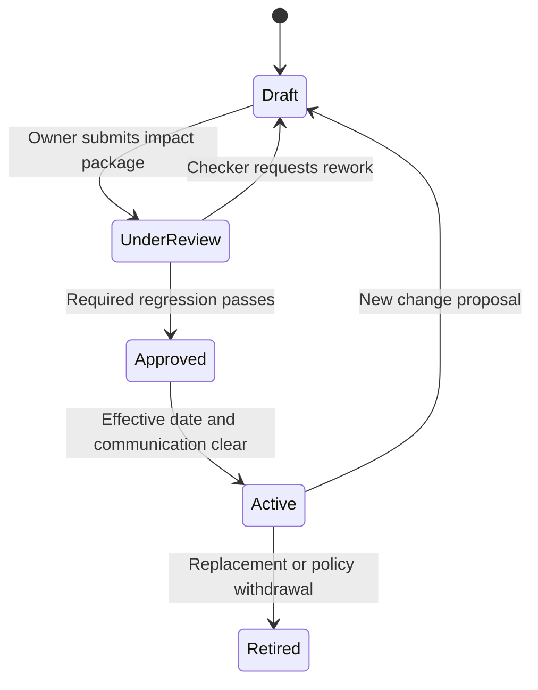

# Governance and Value Operating Model

## Purpose

This operating model explains how the portfolio moves from a document checklist prototype to a controlled commercial credit transformation product. It connects decision rights, source evidence, business rules, human judgment, release assurance, and measurable outcomes.

All data, thresholds, roles, and decisions are synthetic portfolio examples.

## End-to-End Control Model

```mermaid
flowchart LR
    A[Customer and Facility Evidence] --> B[Critical Data Quality Gate]
    B --> C[Versioned Business Rules]
    C --> D[Checklist, Routing, and Exception Decisions]
    D --> E[Evidence-Grounded Credit Memo]
    E --> F[Credit Analyst Review]
    F --> G[Independent Approval]
    G --> H[Release and Cutover Gates]
    H --> I[Hypercare and Outcome Measurement]
    I --> J[Roadmap and Rule Change Decisions]
    J --> C
```

The product does not treat automation as the final decision-maker. Automation structures evidence, detects gaps, applies explainable rules, and prepares the decision package. Accountable people remain responsible for review, approval, risk acceptance, and production release.

## Decision Rights

| Decision | Maker | Checker / Accountable Authority | Minimum Evidence |
| --- | --- | --- | --- |
| Document waiver request | RM or Credit Analyst | Credit Approver | Reason, alternative evidence, expiry, owner, and audit trail. |
| Approval route override | Authorized Credit user | Independent Approver | Original route, override reason, authority, maker-checker, and audit event. |
| Credit memo section review | Credit Analyst | Credit Approver | Source fields, governed rules, confidence, missing evidence, and version. |
| Business rule change | Rule Owner | Rule Approver / Control Owner | Current and proposed logic, impact analysis, regression evidence, effective date, and communication. |
| Data quality disposition | Data Steward | Data Owner | Root cause, affected records, downstream decision impact, remediation, and reconciliation. |
| Product investment priority | Product Owner | Sponsor / Governance Forum | Outcome, value, risk reduction, effort, financial viability, and dependency assessment. |
| Go-live decision | Release Manager prepares | Release Steering Committee decides | Readiness gates, defects, data reconciliation, controls, operations, training, cutover, rollback, and residual risk. |

## Credit Memo Control Standard

Every generated section must contain:

- stable section ID and document version;
- narrative derived from controlled case evidence;
- source field references;
- active or proposed business rule references;
- evidence confidence;
- explicit missing-evidence list;
- Generated, Needs Evidence, Reviewed, or Approved status;
- independent human approval before final use.

Approval remains blocked when evidence grounding, human review, public-data masking, or required source evidence is incomplete. The Assisted Draft mode is a portfolio simulation; no external AI API or live model is called.

## Rule Governance Lifecycle

The lifecycle gate requires maker-checker separation, requirement linkage, UAT scope, impact analysis, effective date, and the designated regression scenario. A known design gap is a valid test outcome but cannot be treated as passed activation evidence.

## Data Governance Standard

Critical data elements are selected because they can change document requirements, credit analysis, delegated authority, readiness, or management reporting.

For each element, the product records:

- approved business definition;
- system of record and physical source field;
- transformation or calculation;
- consuming business rules;
- downstream document, decision, and report usage;
- accountable data owner and operational steward;
- completeness, validity, recency, reconciliation, and override checks;
- quality score and lineage coverage;
- open issue root cause, downstream impact, remediation, and due date.

A data issue is not closed merely because a field is populated. Closure requires proof that the corrected value is reconciled and that affected downstream decisions have been reassessed where necessary.

## Benefits Realization Standard

Feature delivery is not treated as value realization. Each outcome requires:

| Element | Control Question |
| --- | --- |
| Baseline | What was measured before the change, using which definition and period? |
| Target | What result is expected, by when, and who approved it? |
| Current result | What is the latest evidenced position? |
| Owner | Who is accountable for achieving and explaining the outcome? |
| Evidence source | Can the metric be reproduced from governed data? |
| Financial viability | What volume, effort, cost, realization haircut, payback, and net benefit assumptions apply? |
| Decision | Should the roadmap continue, change, pause, or stop based on evidence? |

Capacity released is reported separately from cashable savings. The portfolio applies a realization haircut to avoid presenting the full theoretical benefit as guaranteed value.

## Release Decision Standard

| Posture | Rule | Required Decision |
| --- | --- | --- |
| No-Go | At least one gate is Block. | Close the blocker or obtain explicit authority to re-plan; do not proceed through normal release approval. |
| Conditional Go | No Block gate and at least one Watch gate. | Name the risk owner, remediation date, monitoring threshold, and accepting authority. |
| Go | Every gate is Pass. | Proceed within the approved window and monitor hypercare thresholds. |

The release pack covers business journeys, UAT, data migration, technology deployment, access and segregation, procedures, training, support, cutover validation, rollback triggers, and early-life monitoring.

## Senior BA Interview Narrative

1. Start with the fragmented commercial credit problem and define the target operating outcome.
2. Show how Case 360 creates a single evidence context rather than another isolated screen.
3. Generate a high-risk credit memo and explain why unsupported evidence blocks approval.
4. Demonstrate a proposed rule change, downstream impact, regression gap, and activation decision.
5. Trace one critical data issue into approval and document outputs.
6. Recalculate the value case and explain the difference between delivered scope and realized benefit.
7. Present the release No-Go recommendation, cutover rollback criteria, and named residual-risk owners.
8. Close with the traceability chain from requirement to rule, data, UAT, change request, audit evidence, release, and value.

## Public Portfolio Boundary

This model demonstrates analysis and governance capability. It is not a production credit platform, an automated credit decision model, a regulatory interpretation, or a replacement for bank policy, legal review, data governance, model risk management, information security, or accountable credit judgment.
